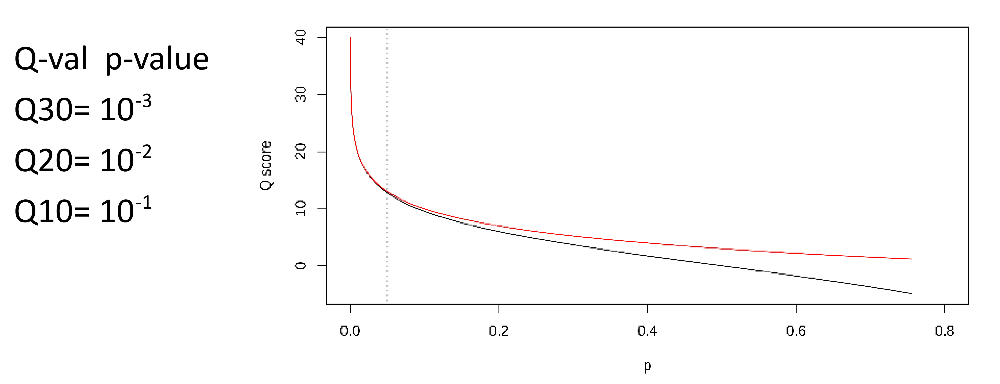

Similar to [[FASTA files|FASTA]], FASTQ is also a text based file format, but it is mainly used for [[Sequencing|nucleotide]] sequence data. The main difference to FASTA is, that it also includes a quality score of the sequence. The quality score of the sequence is added for each nucleotide below the sequence. The header starts with an @-symbol and the end of the sequence is marked by a + sign.

```
@Sequence_ID optional description
ATGCNNNNAGCTTGA....
+
!''*((((***+))%%%++)(%%%%).1***-+*''))**
```
The quality score can be used directly for the calculation of the **Phred** score (Q).
$$
Q = -10log_{10}(P)
$$
Where P is the probability of a wrong base in the sequence. The higher the Q value, the lower the probability of finding the wrong base.

---
Created: 2024-11-26 09:11